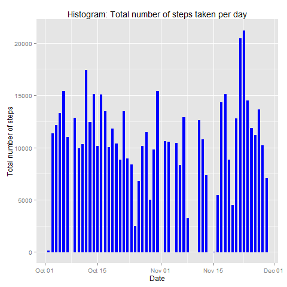
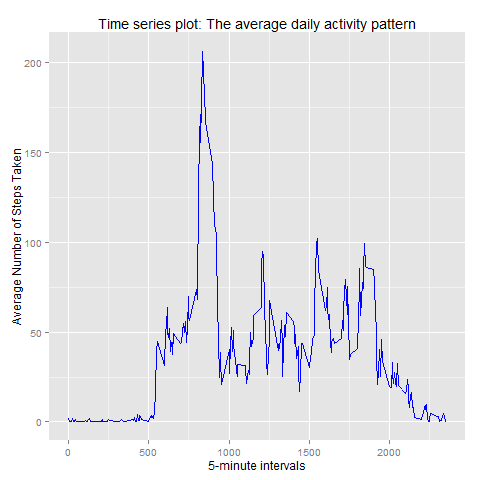
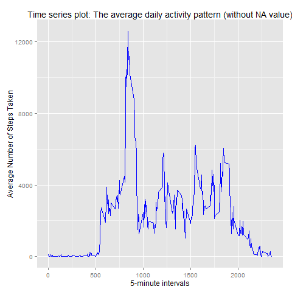
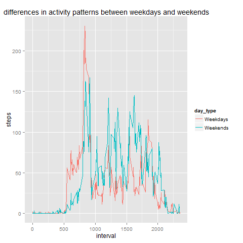

## Loading and preprocessing the data

This is to load and process the data into a format suitable for my analysis.

```{r}
data <- read.csv("activity.csv", header= TRUE, colClasses=c("numeric", "Date","numeric")) 

```

## What is mean total number of steps taken per day?
1. Make a histogram of the total number of steps taken each day (ignore the missing values in the dataset)

```{r}
library(ggplot2)
StepsTaken <- aggregate(formula=steps ~ date, data = data, FUN = sum, na.rm=TRUE)
ggplot(StepsTaken, aes(date, steps)) + geom_bar(stat = "identity", colour = "blue", fill = "blue", width = 0.5)+ labs(title = "Histogram: Total number of steps taken per day", x = "Date", y = "Total number of steps")
```

 


2. Calculate and report the mean and median total number of steps taken per day

Here is derived dataset that I'm using.
```{r}
head(StepsTaken)
```

```
##         date steps
## 1 2012-10-02   126
## 2 2012-10-03 11352
## 3 2012-10-04 12116
## 4 2012-10-05 13294
## 5 2012-10-06 15420
## 6 2012-10-07 11015
```

```{r}
mean(StepsTaken$steps)
```
```
## [1] 10766.19
```
```{r}
median(StepsTaken$steps)
```
```
## [1] 10765
```


## What is the average daily activity pattern?
1. Make a time series plot of the 5-minute interval (x-axis) and the average number of steps taken, averaged across all days (y-axis)

```{r}
AvgActivity <- aggregate(formula=steps ~ interval, data = data, FUN = mean, na.rm=TRUE)
ggplot(AvgActivity, aes(interval, steps)) + geom_line(color = "blue", size = 0.5) + labs(title = "Time series plot: The average daily activity pattern", x = "5-minute intervals", y = "Average Number of Steps Taken")
```

 

2.Which 5-minute interval, on average across all the days in the dataset, contains the maximum number of steps?

```{r}
ord <- AvgActivity[order(-AvgActivity$steps),]
head(ord,1)
```

```
##     interval    steps
## 104      835 206.1698
```

## Imputing missing values
1. Calculate and report the total number of missing values in the dataset
```{r}
sum(is.na(data))
```

```
## [1] 2304
```

2.Devise a strategy for filling in all of the missing values in the dataset. The strategy does not need to be sophisticated. For example, you could use the mean/median for that day, or the mean for that 5-minute interval, etc.

Strategy to filling missing value is to use the average steps for the 5 min interval to fill each NA value in the steps column.

3.Create a new dataset that is equal to the original dataset but with the missing data filled in.


```{r}
NoNAData<-data 
for (i in 1:nrow(NoNAData)) {
        if (is.na(NoNAData$steps[i])) {
             int <- NoNAData$interval[i]
             avgint <- AvgActivity[AvgActivity$interval == int,]$steps
             NoNAData$steps[i] <- avgint
          }
 }
sum(is.na(NoNAData))
```
```
## [1] 0
```

4. Make a histogram of the total number of steps taken each day and Calculate and report the mean and median total number of steps taken per day. Do these values differ from the estimates from the first part of the assignment? What is the impact of imputing missing data on the estimates of the total daily number of steps?

```{r}
AvgActivity2 <- aggregate(formula=steps ~ interval, data =  NoNAData, FUN = sum, na.rm=TRUE)
ggplot(AvgActivity2, aes(interval, steps)) + geom_line(colour = "blue", 
size = 0.5) + labs(title = "Time series plot: The average daily activity pattern (without NA value)",
x = "5-minute intervals", y = "Average Number of Steps Taken")
```

 

```{r}
StepsTaken2 <- aggregate(formula=steps ~ date, data = NoNAData, FUN = sum, na.rm=TRUE)
mean(StepsTaken2$steps)
```
```
## [1] 10766.19
```
```{r}
median(StepsTaken2$steps)
```
```
## [1] 10766.19
```

After filling missing value, the mean and median are bothe same (10766.19)

## Are there differences in activity patterns between weekdays and weekends?

1. Create a new factor variable in the dataset with two levels - "weekday" and "weekend" indicating whether a given date is a weekday or weekend day.
```{r}
newData <- NoNAData
newData$day <- weekdays(as.Date(newData$date))
newData$day_type <- as.factor(ifelse(newData$day %in% c("Saturday", "Sunday"), "Weekends", "Weekdays"))
head(newData)
```

```
##       steps       date interval    day day_type
## 1 1.7169811 2012-10-01        0 Monday Weekdays
## 2 0.3396226 2012-10-01        5 Monday Weekdays
## 3 0.1320755 2012-10-01       10 Monday Weekdays
## 4 0.1509434 2012-10-01       15 Monday Weekdays
## 5 0.0754717 2012-10-01       20 Monday Weekdays
## 6 2.0943396 2012-10-01       25 Monday Weekdays
```

2. Make a panel plot containing a time series plot  of the 5-minute interval (x-axis) and the average number of steps taken, averaged across all weekday days or weekend days (y-axis). 


```{r}
newData2 <- aggregate(newData$steps, list(newData$day_type, newData$interval), mean)
names(newData2) <- c("day_type", "interval","steps")
qplot(interval, steps, data=newData2, color=day_type, geom="line") + ggtitle("differences in activity patterns between weekdays and weekends")
```

 